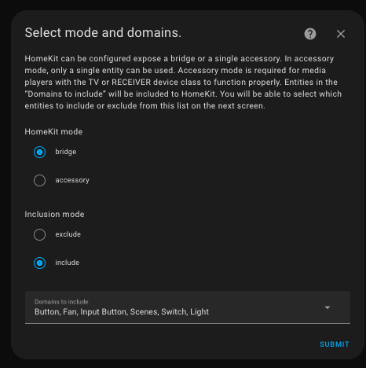

# HomeKit Room Sync

[](https://github.com/lcrostarosa/homekit-room-sync)
[](https://github.com/hacs/integration)
[](https://opensource.org/licenses/MIT)
[](https://github.com/lcrostarosa/homekit-room-sync/blob/master/CONTRIBUTING.md)

A Home Assistant custom integration that automatically synchronizes your Home Assistant Areas with HomeKit Room assignments.

## Why This Exists

The [HomeKit Bridge configuration](https://www.home-assistant.io/integrations/homekit#configuration) in Home Assistant has **no concept of filtering entities by Area**.

You can filter by domains (lights, switches, fans, etc.) and use wildcards, but this approach is opinionated and becomes a maintenance headache over time. Every time you add a new device, you have to think about whether it matches your existing filters.

**The problem:** You organize your smart home by rooms (Areas) in Home Assistant, but HomeKit Bridge forces you to think in terms of entity types and naming patterns. This disconnect makes configuration fragile and tedious to maintain.

**The solution:** HomeKit Room Sync bridges this gap. Organize your devices into Areas in Home Assistant, and this integration automatically syncs those room assignments to your HomeKit bridges. Add a device to an Area once, and it syncs to your Homekit Bridge.

## Installation

### HACS (Recommended)

1. Open HACS in your Home Assistant instance
2. Click on "Integrations"
3. Click the three dots in the top right corner
4. Select "Custom repositories"
5. Add this repository URL: `https://github.com/lcrostarosa/homekit-room-sync`
6. Select category: "Integration"
7. Click "Add"
8. Search for "HomeKit Room Sync" and install it
9. Restart Home Assistant

### Manual Installation

1. Download the `custom_components/homekit_room_sync` folder from this repository
2. Copy it to your Home Assistant `config/custom_components/` directory
3. Restart Home Assistant

## Configuration

1. Go to **Settings** → **Devices & Services**
2. Click **+ Add Integration**
3. Search for "HomeKit Room Sync"
4. Select a HomeKit Bridge from the dropdown (Friendly names are displayed)
5. Optionally select a default room for entities without area assignments
6. Click **Submit**


*Select the HomeKit Bridge you want to sync*

### Usage

Once configured, the integration works automatically in the background.

1. **Assign Areas in Home Assistant**: Go to **Settings > Devices & Services > Entities** and assign an **Area** to your entities (e.g., assign a Light to "Living Room").
2. **Wait for Sync**: The integration monitors these changes. After a short delay (debounced), it updates the HomeKit configuration.
3. **Check Apple Home**: Open the Home app on your iOS device. The device should now be in the corresponding Room in HomeKit.


*Devices automatically assigned to the correct room in Apple Home*

### Configuration Options

| Option | Description |
|--------|-------------|
| **HomeKit Bridge** | The HomeKit bridge to sync room assignments for |
| **Default Room** | The room to assign to entities that don't have an area in Home Assistant (optional) |
| **Allowed Areas** | (Optional) Limit syncing to entities in these areas; entities outside are removed from the HomeKit bridge during sync |

### Multiple Bridges

If you have multiple HomeKit bridges, you can add the integration multiple times, once for each bridge. Each bridge can have its own default room setting.

## How It Works

1. **Listen for registry changes** – the integration subscribes to entity, device and area registry signals so it knows when an entity moves rooms, areas are renamed, or new hardware appears.
2. **Compute an exposure plan** – for each managed HomeKit bridge we calculate the entities that belong to the selected Areas, then merge any manual include/exclude overrides.
3. **Update the official HomeKit config entry** – we write the computed lists to the bridge’s `filter` (`include_entities`, `exclude_entities`, `include_areas`) and update `entity_config` so every exposed entity gets a HomeKit `room` matching its Home Assistant Area (or the configured default).
4. **Reload the HomeKit bridge** – after updating the config entry we call `async_reload` on the HomeKit integration so it re-reads the filter and reconfigures the bridge.

Because the integration now uses Home Assistant’s public config entry APIs, there are no brittle edits to `.storage/homekit.*` files.

During every configuration change (initial setup or options flow) and every automatic sync you’ll see a log entry that previews which entities will be exposed so you can verify the filters before they reach Apple Home.

### Exposure Rules

- **Area filter** – when you select Areas, only entities that resolve to those Area IDs (either directly or via their device) are exposed.
- **Include overrides** – always expose these entity IDs even if they are outside the Area filter.
- **Exclude overrides** – remove these entity IDs even if they belong to an allowed Area.
- **Room naming** – the HomeKit `room` value matches the Area name. If an entity does not have an Area but you provide a default room, that label is used instead.
- **Automatic resync** – any registry change (entity added/removed, Area rename, moving a device between Areas) triggers a debounced recomputation followed by a HomeKit bridge reload.

### Room Assignment Priority

For each entity, the room is determined in the following order:

1. **Entity's direct area**: If the entity has an area assigned directly
2. **Device's area**: If the entity's parent device has an area assigned
3. **Default room**: The configured default room for the bridge
4. **No change**: If none of the above, the room assignment is left unchanged

## Important Notes

- The integration updates the official HomeKit config entry using Home Assistant’s public APIs—no `.storage` files are touched.
- Every sync logs the list of exposed entities so you can confirm the filters that will reach Apple Home.
- If you change Areas or move devices frequently, expect the bridge to reload automatically; this is intentional so HomeKit always reflects the latest assignments.

### Supported Home Assistant Versions

- Home Assistant 2025.12.1 or newer

### Known Limitations

- Changes may take a few seconds to appear in the Apple Home app after sync
- Some HomeKit apps may cache room assignments; force-close and reopen the app if changes don't appear
- Exposure is controlled by the HomeKit Bridge integration (include domains/areas). Room alignment with HomeKit still requires writing `room_name` into the bridge state; HomeKit does not auto-map HA areas to rooms on its own.

## Troubleshooting

### Sync Not Working

1. Check that the HomeKit Bridge integration is set up and running
2. Verify that entities are exposed to HomeKit
3. Check the Home Assistant logs for error messages

### Rooms Not Updating in Apple Home

1. Wait a few seconds for the sync to complete
2. Force-close the Apple Home app and reopen it
3. Try removing and re-adding the bridge in Apple Home (last resort)

### Enable Debug Logging

Add this to your `configuration.yaml`:

```yaml
logger:
  default: info
  logs:
    custom_components.homekit_room_sync: debug
```

## Development

### Setup

```bash
# Clone the repository
git clone https://github.com/lcrostarosa/homekit-room-sync.git
cd homekit-room-sync

# Install dependencies with Poetry
poetry install

# Run linting
poetry run ruff check .

# Run type checking
poetry run mypy custom_components/homekit_room_sync
```

### Local Deployment via SSH

For quick development iteration, you can deploy directly to your Home Assistant server using the included deploy script.

#### Quick Start

```bash
# Deploy to a specific host
make deploy HOST=192.168.1.100

# Or use the script directly
./scripts/deploy.sh homeassistant.local
```

#### Using Environment Variables

Create a `.env` file for persistent configuration:

```bash
# Copy the example file
cp env.example .env

# Edit with your settings
nano .env
```

Example `.env` configuration:

```bash
HA_HOST=192.168.1.100
HA_USER=root
HA_SSH_PORT=22
HA_CONFIG_PATH=/config
HA_RESTART=false
```

Then simply run:

```bash
make deploy
```

#### Deploy Script Options

```bash
./scripts/deploy.sh [OPTIONS] [HOST]

Options:
  -h, --help          Show help message
  -u, --user USER     SSH user (default: root)
  -p, --port PORT     SSH port (default: 22)
  -c, --config PATH   HA config directory (default: /config)
  -r, --restart       Restart Home Assistant after deployment
  --dry-run           Show what would be done without executing
```

#### Common Configuration Paths

| Installation Type | Config Path |
|-------------------|-------------|
| HAOS / Docker | `/config` |
| Supervised | `/usr/share/hassio/homeassistant` |
| Core (venv) | `/home/homeassistant/.homeassistant` |

### Contributing

Contributions are welcome! Please feel free to submit a Pull Request.

## License

This project is licensed under the MIT License - see the [LICENSE](LICENSE) file for details.

## Acknowledgments

- [Home Assistant](https://www.home-assistant.io/) for the amazing home automation platform
- [HACS](https://hacs.xyz/) for making custom integration distribution easy
